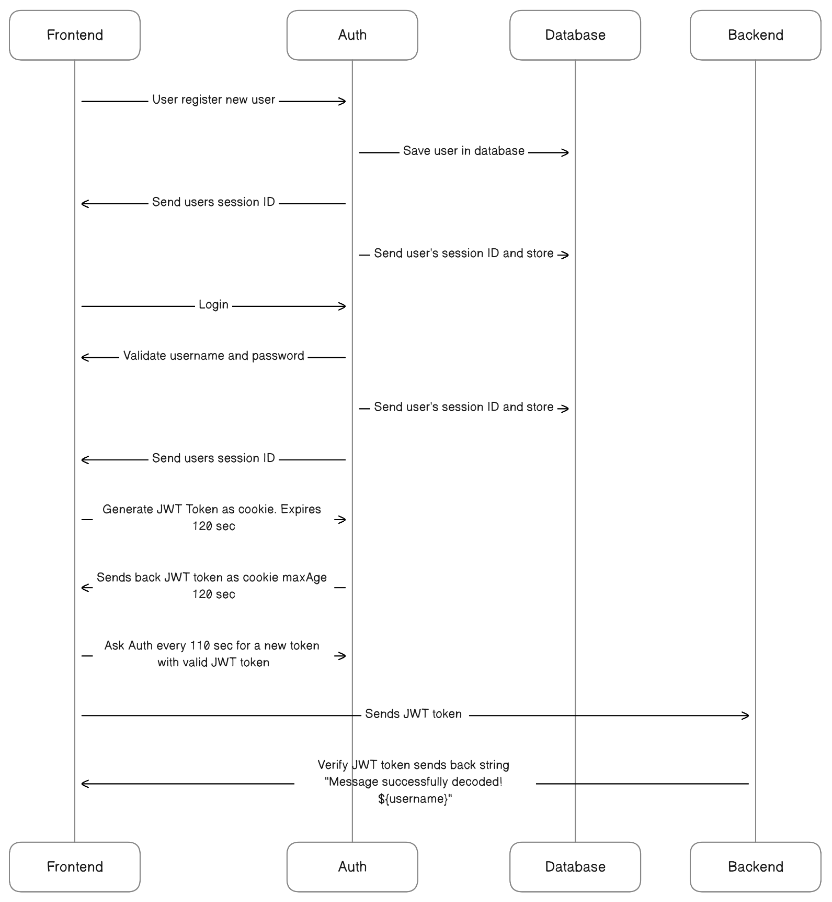

## **Kurs**: Webbsäkerhet analys och implementation




### Grupp : 

* Yulia Gutorova
* Jonathan Nilsson   


### Uppgift: Frontend för autentisering och auktorisering

**Mål**: *"Målet är att utrusta våra
studenter med rudimentär kunskap och praktiska färdigheter för att förstå säkerhetskrav och
lagstiftning som påverkar frontendutvecklare och att implementera säkerhetsåtgärder i frontend
som är kompatibla med backend-systemen."*

**Hur vi löste uppgiften:** *Teamet valde att försöka lösa uppgiften genom att implementera olika tekniker.* <br> **Autentisering:** *Passport-integration med local-strategy(Användarnamn och lösenord) samt google-recaptcha-v2*<br>
**Auktorisering:**  *Teamet valde att använda sig utav sessions och cookies i detta projekt, eftersom det ansågs säkrare än att förvara datan i dem istället för localstorage hos respektive användare.*

### Starta projektet:

```js
git clone https://github.com/yulia-gutorova/websec-frontend.git
cd websec-react
npm install
npm run dev
```

### Npm-paket som nyttjas i projektet:
```js
axios
cypress
cypress-iframe
react-google-recaptcha
react-helmet-async
react-hook-consent
react-hook-form
```

### Tekniker:
* [Cypress](https://www.cypress.io) - Testverktyg för frontend - kan utföra tester såsom komponent, integration och API-tester.
* [Recaptcha](https://www.npmjs.com/package/react-google-recaptcha-v2) - Autentisering med hjälp av recaptcha, säkrar inloggning emot bot-attacker.
* [React-hook-consent](https://www.npmjs.com/package/react-hook-consent) - Verktyg för att implementera samtycke till kakor och möjliggör lagring hos användaren.